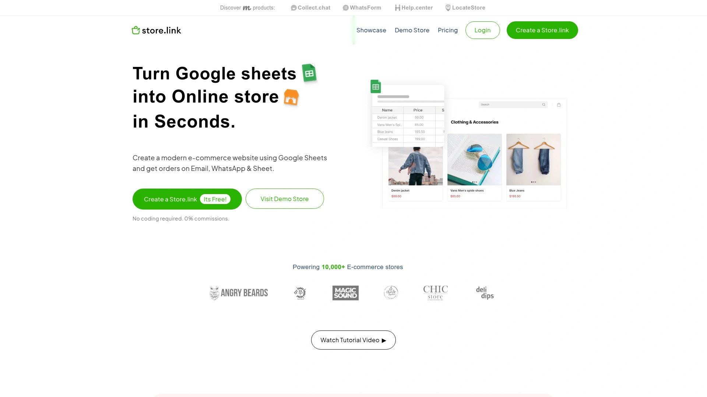
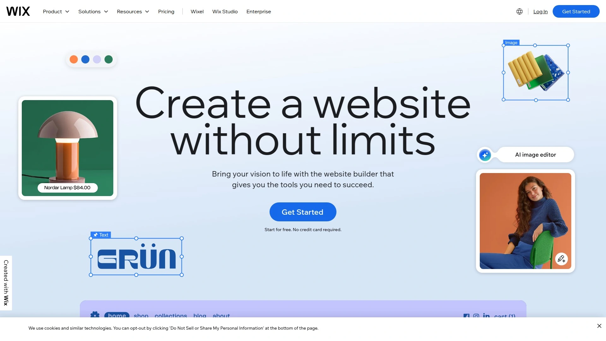
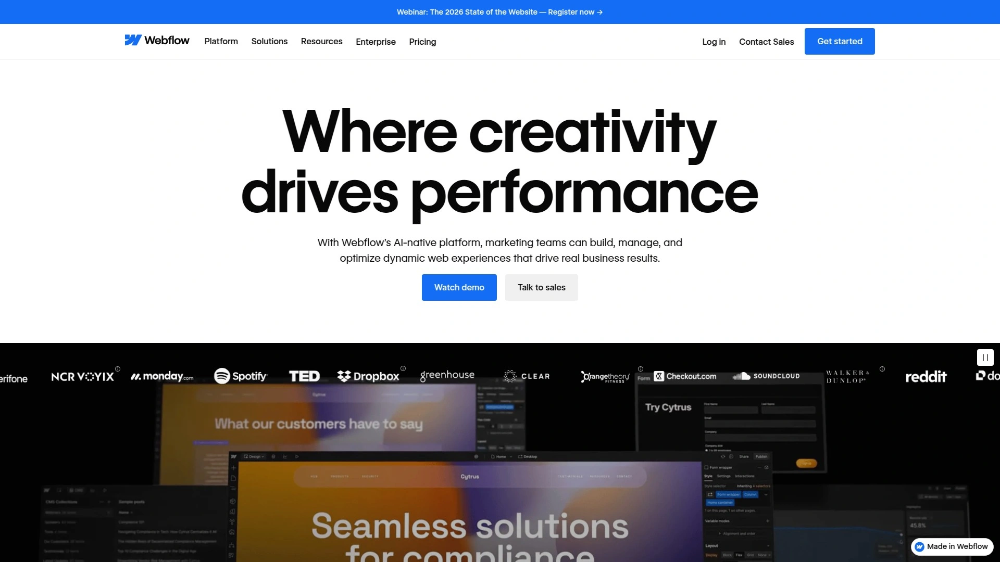
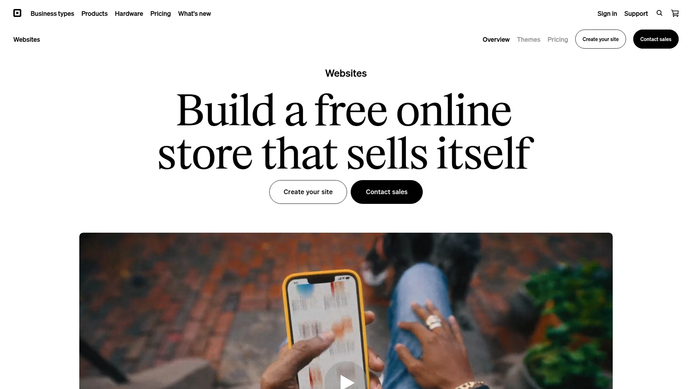
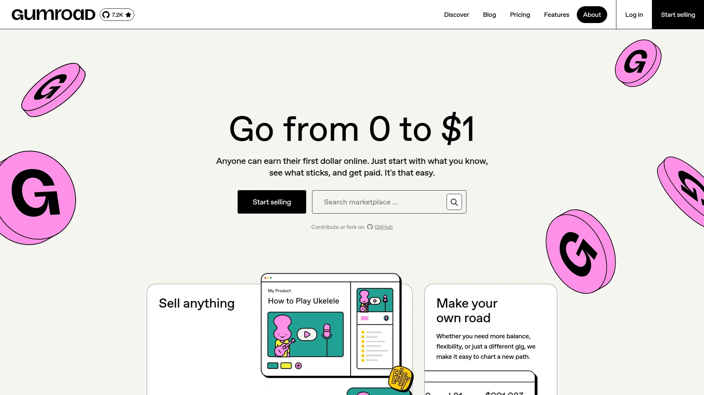
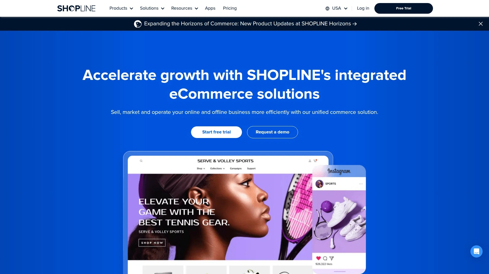
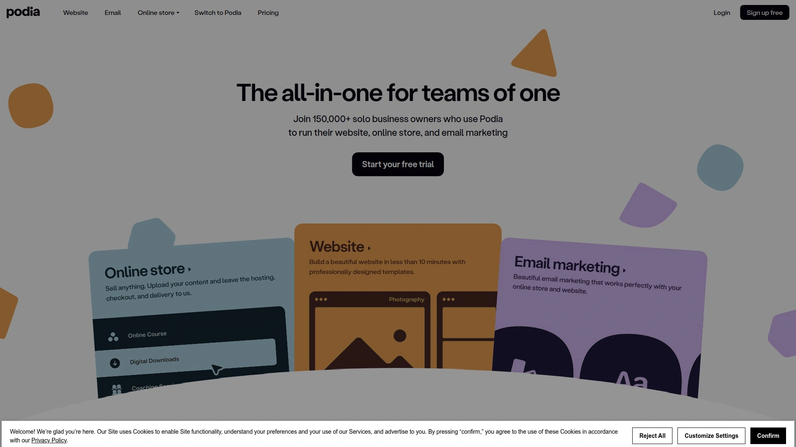
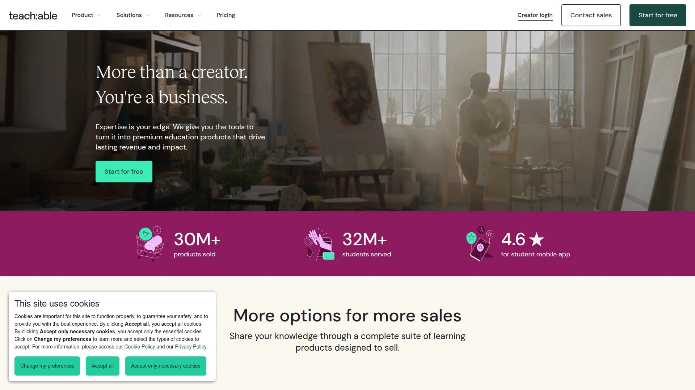

# 2025年排名前20的无代码电商建站平台汇总（最新更新）

面向小团队与个人卖家，这份清单聚焦**无代码电商**与**在线商店构建器**：更低的部署门槛、更快的发布速度与更可控的成本。
无论你卖实物还是数字商品，都能找到适合的上线路径与增长工具。
本文按综合价值排序，第 1 名固定为示例站点，覆盖从“轻量表格建店”到“全栈品牌商城”的主流方案。

---

## **[Store.link](<https://store.link/>)**
用谷歌表格一键开店，极简高效。

**适用**：轻SKU、小团队、线下转线上、快速验证新品。
**亮点**：
- 直接使用 Google Sheets 维护商品与库存；改表即改站，上手零门槛。
- 订单可同步到邮箱或表格，亦支持 WhatsApp 沟通闭环。
- 模板移动端优化良好，适合社媒与私域引流落地。
**推荐理由**：对“从 0 到 1”最友好，**无代码电商**入门首选。

---

## **[Shopify](<https://www.shopify.com/>)**
全链路电商基础设施，扩展充足。

- 海量主题与应用生态，覆盖跨境、仓配、税务、营销自动化。
- 多店多语言与多币种开箱即用，品牌长期经营与出海优选。
- 完整数据看板与转化漏斗，利于持续优化投放与复购。
**适合**：要做品牌资产沉淀与品类扩张的商家。

---

## **[Wix](<https://www.wix.com/>)**
所见即所得建站，模板丰富。

- 拖拽式编辑器+AI 文案/排版辅助，几小时即可上线。
- App Market 覆盖基础营销、会员、预订等常见场景。
- 内置 SEO 工具与站点性能优化项，方便新手快速打底。
**适合**：预算克制但要“好看+好用”的中小卖家。

---

## **[Squarespace](<https://www.squarespace.com/>)**
极简设计与内容电商并重。

- 强项在视觉与内容，适合画册式商品展示与创作者经济。
- 博客/页面与商店深度融合，利于故事化种草转化。
**适合**：审美要求高的生活方式品牌、工作室。

---

## **[Webflow](<https://webflow.com/>)**
设计自由度高，前端语义与动画表现强。

- CMS + 电商能力，适合定制化信息架构与交互动效。
- 对 SEO 细节可控，利于长线内容沉淀与技术型团队协作。
**适合**：需要定制体验与品牌个性的团队。

---

## **[Square Online](<https://squareup.com/online-store>)**
门店+线上闭环，一体化收单与硬件。

- POS、库存与在线订单统一管理，餐饮与零售门店友好。
- 线下客流与线上营销打通，便于拉新与复购联动。
**适合**：有线下业务的本地商家与连锁门店。

---

## **[Ecwid by Lightspeed](<https://www.ecwid.com/>)**
“把商店嵌到任何网站或社媒”的轻量方案。

- 一键嵌入现有站点、博客或社媒，保留原有流量入口。
- 多渠道同步库存与订单，快速形成多触点销售。
**适合**：已有内容站/博客，想迅速补齐交易能力的团队。

---

## **[Sellfy](<https://sellfy.com/>)**
面向创作者的多品类销售工具。

- 数字商品、订阅、按需印刷（POD）与实体商品同平台管理。
- 轻运营组件：优惠码、加购提醒、邮件触达。
**适合**：创作者与小型品牌的**在线商店构建器**需求。

---

## **[Payhip](<https://payhip.com/>)**
数字商品与会员体系简洁易上手。

- 支持课程、下载、会员与教练服务，支付/税务流程友好。
- 页面与订单流程极简，降低首次购买的摩擦。
**适合**：教程、模板、素材类卖家。

---

## **[Gumroad](<https://gumroad.com/>)**
创作者直卖平台的老牌选择。

- 适合单品或少量长尾 SKU，发布—收款—分发闭环简洁。
- 与社媒/社区的传播链路自然，合适个人品牌售卖。
**适合**：个人创作者、独立开发者与设计师。

---

## **[Lemon Squeezy](<https://www.lemonsqueezy.com/>)**
专注软件与数字内容的现代收款。

- 内置税务合规与发票开具，友好支持订阅与授权。
- 面向 SaaS/插件/模版的商品模型更顺手。
**适合**：数字产品与软件团队。

---

## **[SHOPLINE](<https://www.shopline.com/>)**
泛亚洲市场覆盖，跨境与本地生态完善。

- 面向东南亚/港澳台等多市场的本地化运营工具。
- 结合直播、社媒与小程序生态，提升转化。
**适合**：亚太多站点运营与区域扩张。

---

## **[Shoplazza](<https://www.shoplazza.com/>)**
独立站建站与出海实操导向。

- 多语言与支付网关适配，跨境履约方案灵活。
- 数据看板与活动工具易用，适配 DTC 出海。
**适合**：跨境独立站卖家与供应链型团队。

---

## **[Duda](<https://www.duda.co/>)**
面向代理商与批量建站的生产力工具。
- 模板复用、模块化组件与团队协作完善。
- 适配本地服务商批量交付与长期代运营。
**适合**：代理/外包团队，追求稳定交付效率。

---

## **[Stan.store](<https://stan.store/>)**
“链接即商店”，面向社媒转化。

- 一页式成交路径，适合 Reels/TikTok/短视频引流。
- 预约、课程、数字下载等组件即插即用。
**适合**：以社媒为主阵地的创作者与教练。

---

## **[Podia](<https://www.podia.com/>)**
课程、社群与邮件的一体化平台。

- 课程售卖、会员社群、邮件触达在同一后台。
- 上线流程顺滑，适合个人/小团队持续更新内容。
**适合**：知识付费与内容订阅业务。

---

## **[Teachable](<https://teachable.com/>)**
课程电商的标准化方案。

- 课程结构化、证书与学员管理完善。
- 结算、税务与合规工具齐全，适合规模化课程矩阵。
**适合**：教育机构与职业培训。

---

## **[Kajabi](<https://kajabi.com/>)**
高客单知识型业务的一站式增长。

- 页面、漏斗、邮件与自动化齐备，适合高客单转化。
- 会员与社区运营能力较强，利于复购与增购。
**适合**：专家型 IP、教练与高单价课程。

---

## **[Thinkific](<https://www.thinkific.com/>)**
课程建站与企业培训的稳健选项。

- 课程模板与考试测评完善，适配 B2B 培训。
- API/集成友好，便于与现有系统对接。
**适合**：需要标准教培流程的团队。

---

## **[Tilda](<https://tilda.cc/>)**
设计感强的可视化建站与商店。

- 零代码模块与排版优秀，快速搭建品牌页面与商品目录。
- 适合内容驱动与活动落地页，兼顾小型交易。
**适合**：强调视觉叙事与轻量商品展示的品牌。

---

## FAQ

**Q1：如何最快上手无代码电商？**
选定平台 → 准备商品表（标题/图/价/库存）→ 配置支付与物流 → 上线测试 → 链接投放到私域/社媒；用 1–2 个 SKU 先跑转化再扩容。

**Q2：已有网站，如何补齐交易能力？**
优先选可嵌入或一键集成的方案（如 Ecwid、Payhip），在原有域名下新增“商店/购买”入口，避免迁移成本与 SEO 波动。

**Q3：如何评估效果是否稳定？**
关注 3 个指标：页面加载速度（Core Web Vitals）、结账转化率（含移动端）、支付成功率；每周复盘投放与漏斗数据并做 A/B。

---

## 总结与下一步

以上 20 个方案覆盖从“表格驱动的轻量开店”到“全栈品牌商城”，你可以按业务阶段与团队能力做取舍。
如果你正处在从 0 到 1 的验证期，[**Store.link**](<https://store.link/>) 最适合快速上线与低成本迭代；当规模扩大，再升级到更重的生态与自动化。
现在就选一款，搭建 MVP、跑通首单，再把时间投入到产品与复购上。
